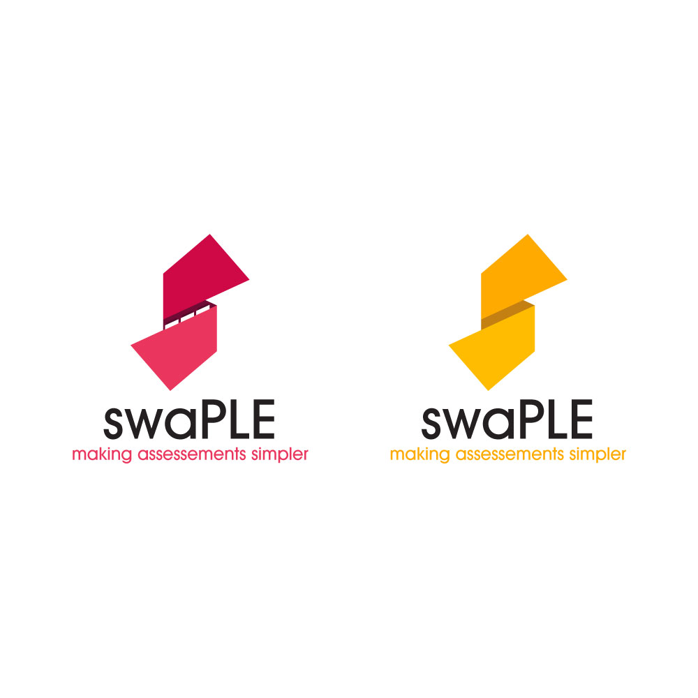
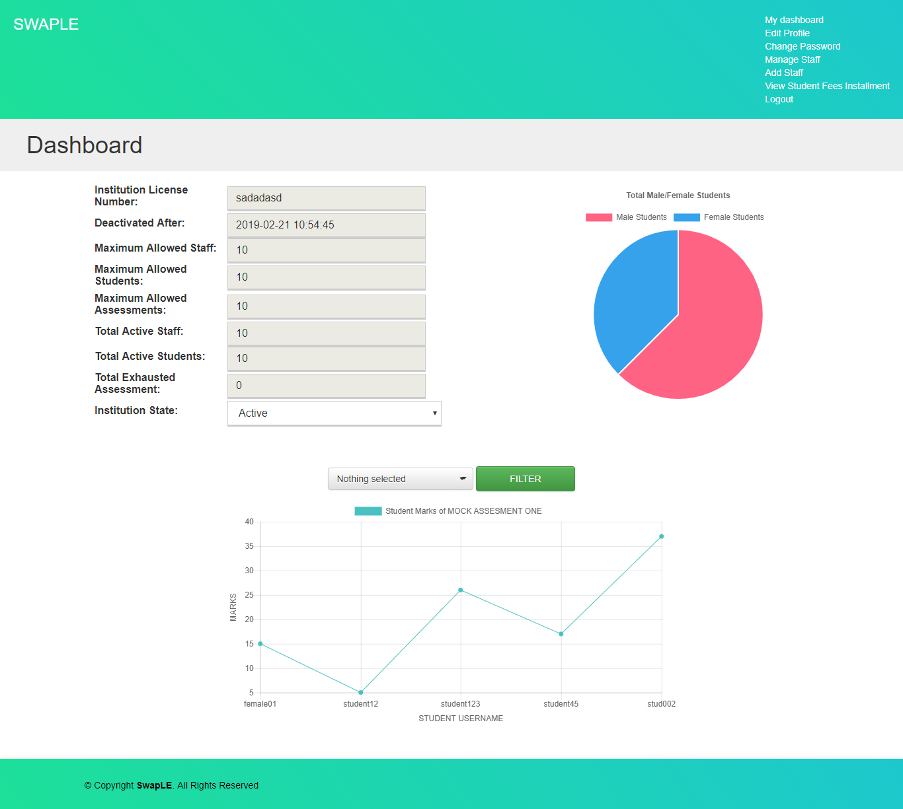
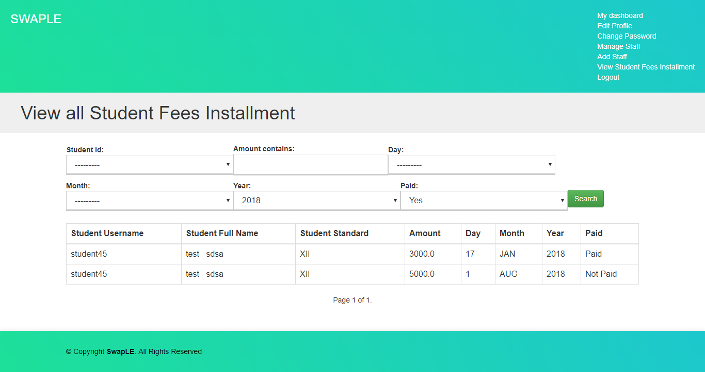
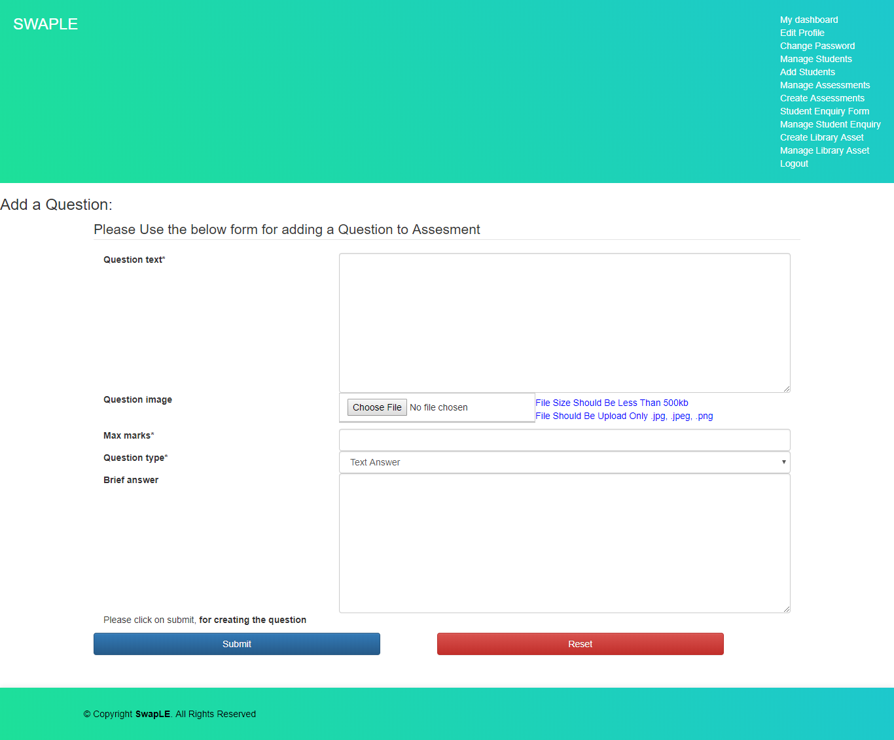
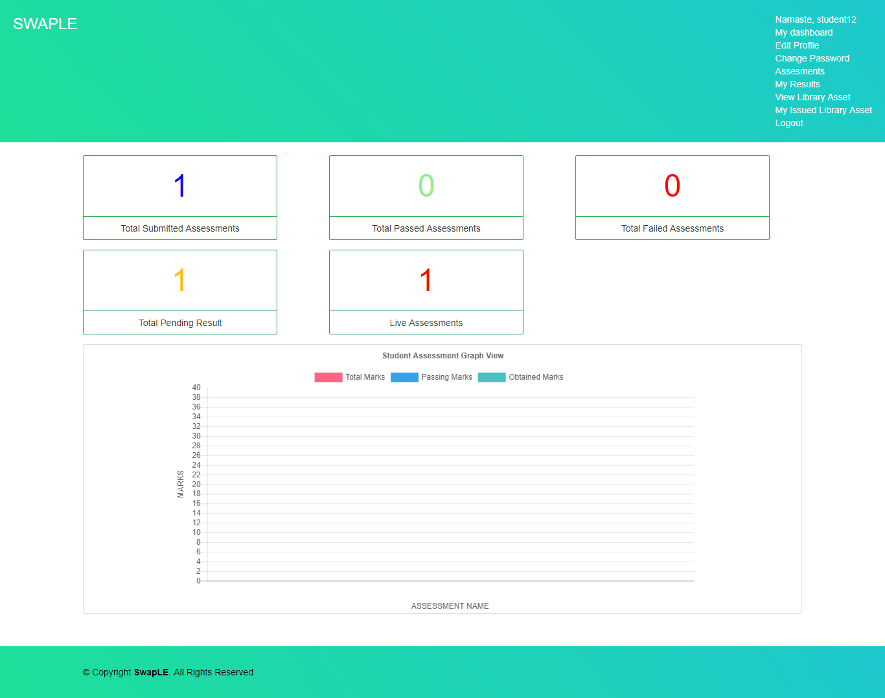
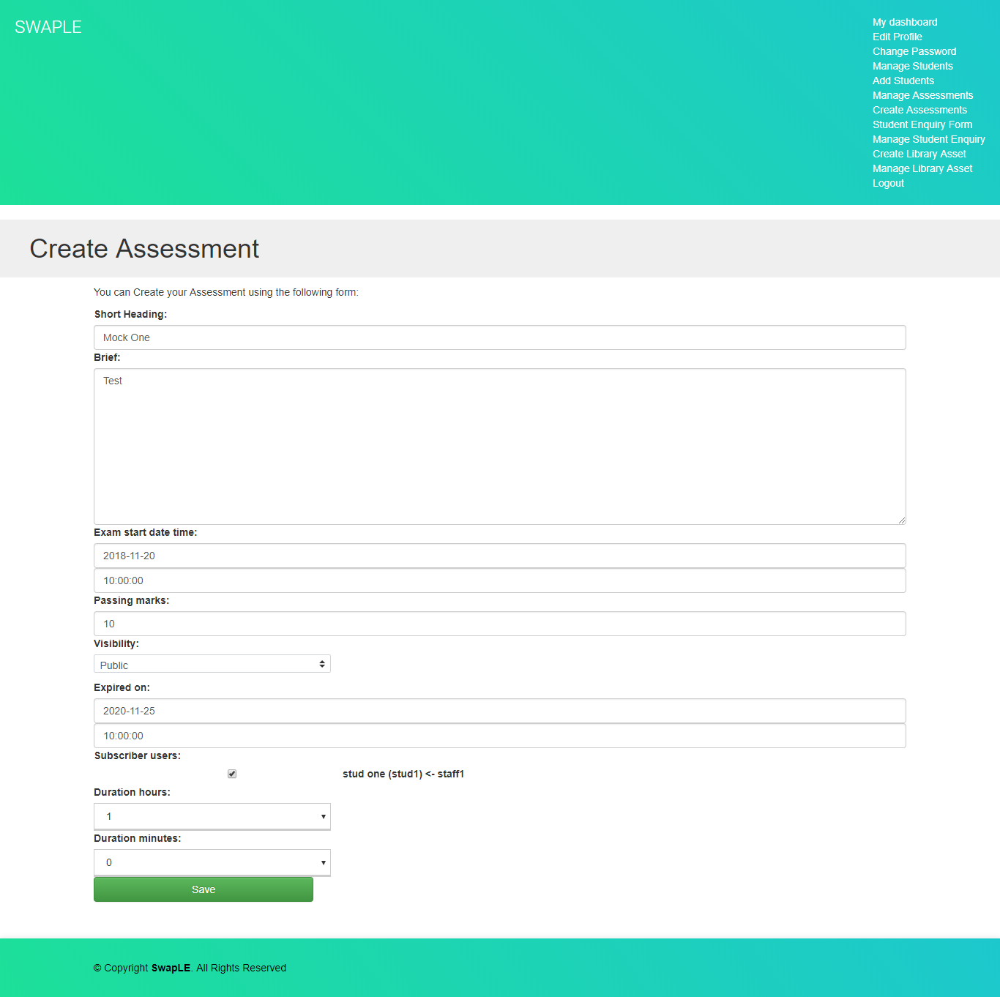
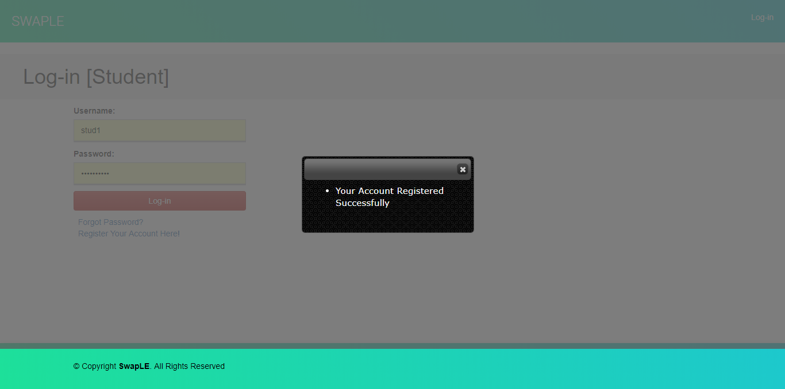
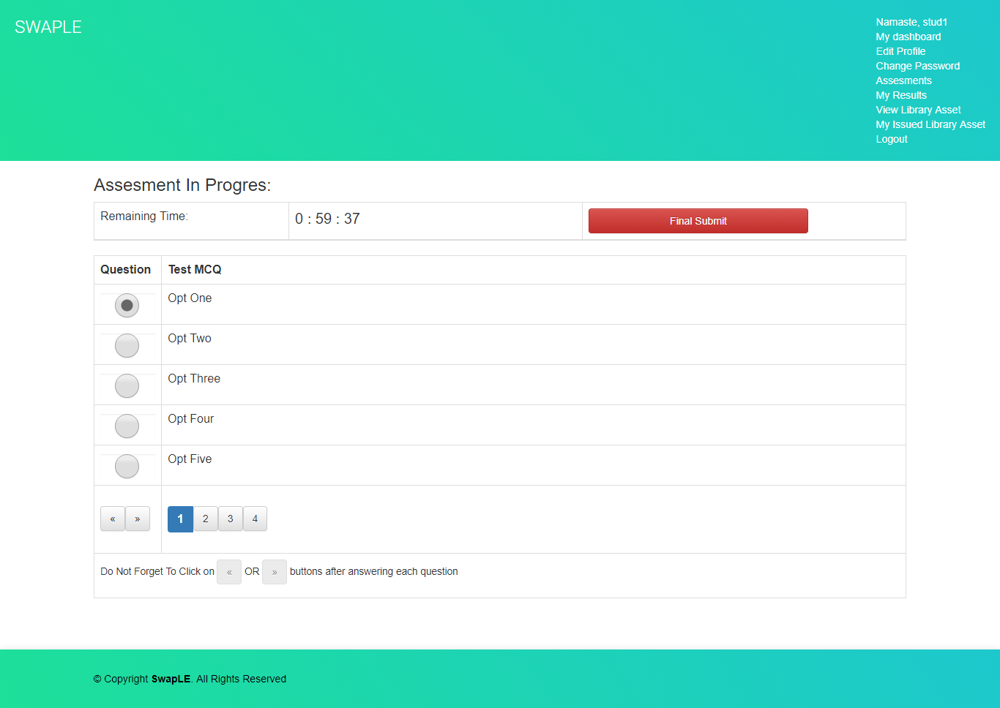
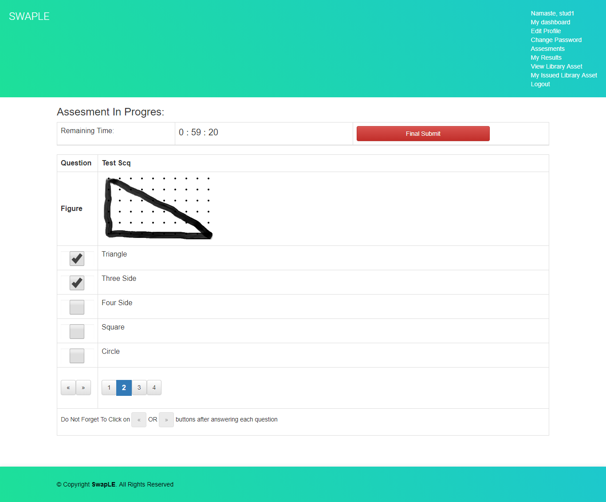

# SwapLE #

### SwapLE is an digital assesment solution for larger institutions enabling them to conduct a paperless examination with instant feedback and reporting. It allows institutions to save there valuable time in evaluation, review and grading assesment.

### How do I get set up? ###

* Install Dependencies
	- Install all the requirements located in requirements folder:
	- `pip install -r requirements.txt`
* Run Database configuration
    - `python manage.py makemigrations`
    - `python manage.py migrate`
* Run tests
	- `python manage.py test`
* Run Server
	- `python manage.py runserver`

### Contribution guidelines ###

* Writing tests
* Code review

### Who do I talk to? ###

* Repo owner or admin
	- shivam9172@gmail.com
	
Major Contributors:
- [V!Ru$](https://github.com/vinaykp2499 "V!Ru$")

##  Few Screen Shot

