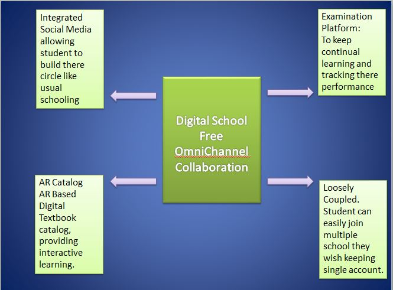
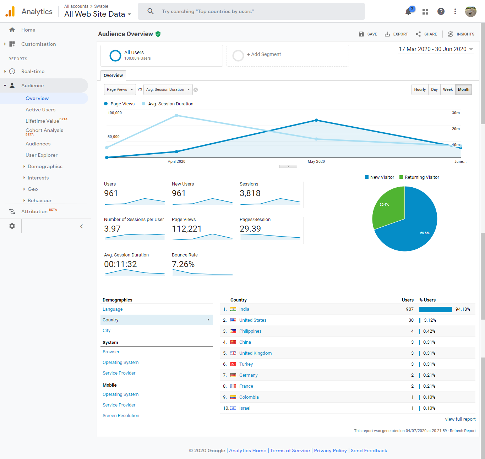
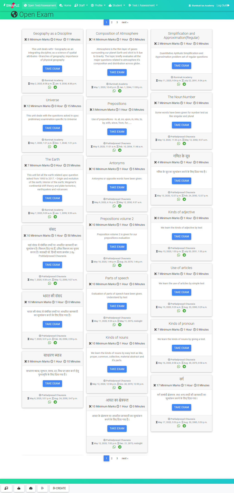
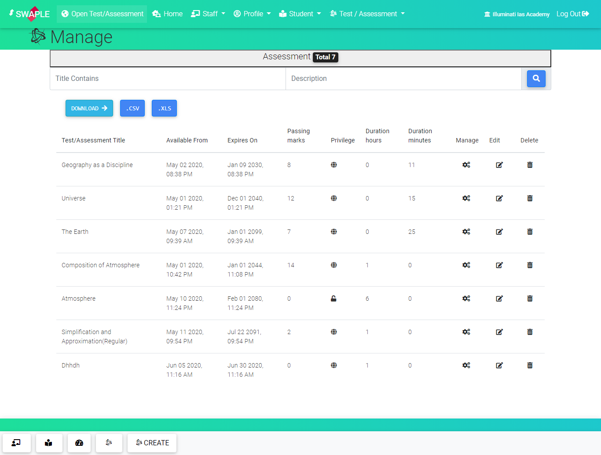
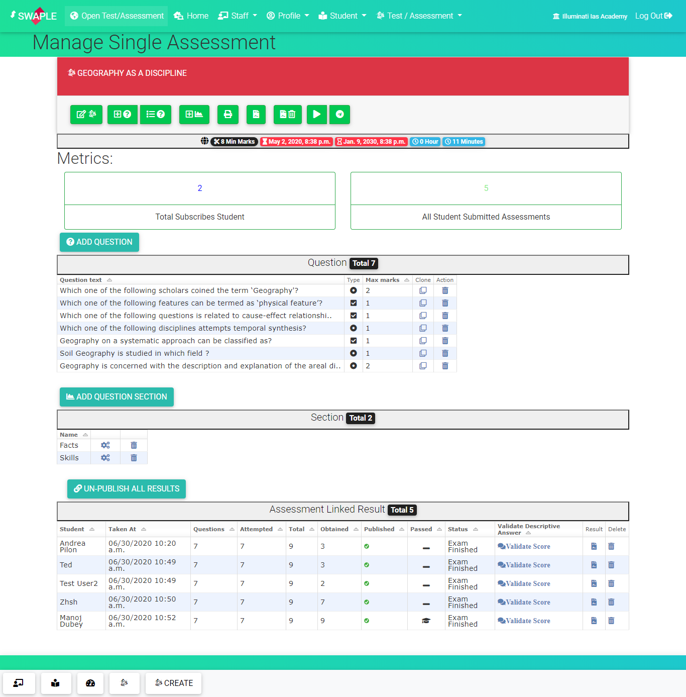
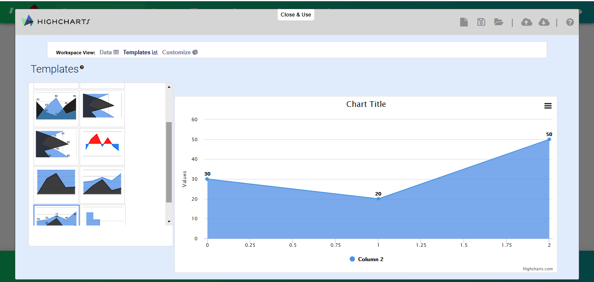
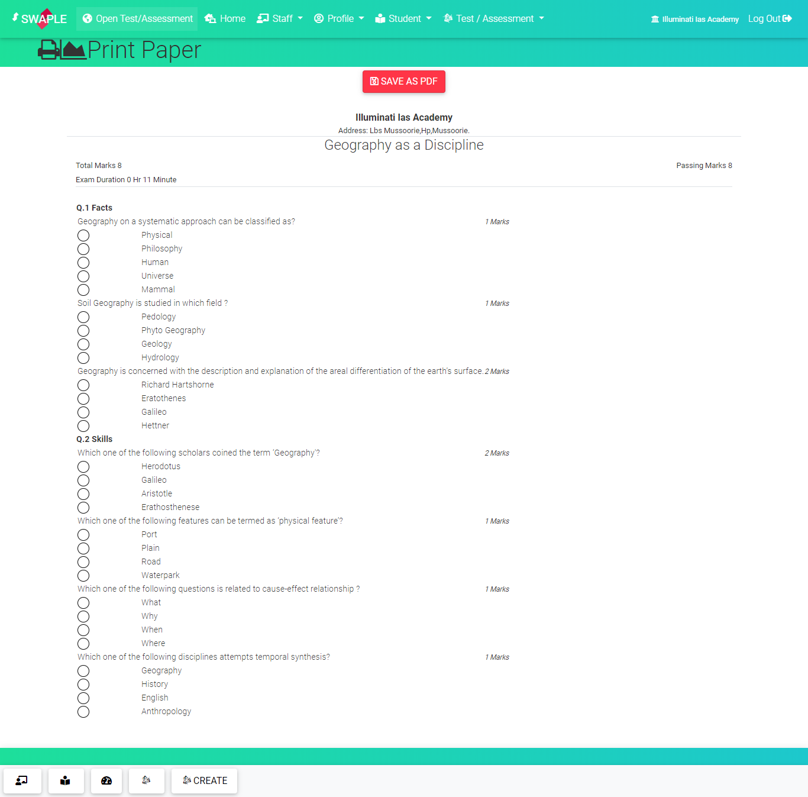
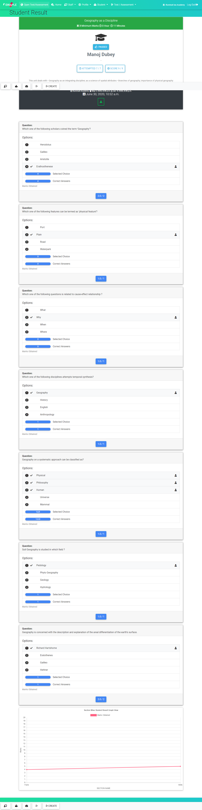
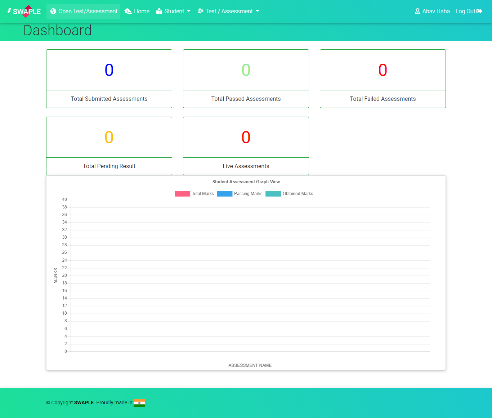

# SWAPLE - NextGen Social Media Schooling #

### Theme : COVID19 ###

### Background
COVID19 has created an huge impact on everyone way of living. In India it has been seen that large number of migrant workers who worked in small industry have migrated back to villages along with there families and childrens.

The large number of childrens  of these families study in government run school and colleges and in this Pandemic it has become more than ever necessity to provide this kids with basic education, motivation and collaboration with there peers students.

An custom made tailored product where student can track their performance, communicate with peer student, collaborate together on assignments, interact with each other and most important they can see themselve growing, learning and inclusive.

### Challenge
1. Several tools in market but not single application which does all: Though big organisation are making tools and application for collaboration, examination and LMS, but this application are limited to big soceity and large number of students are still way out it. Government schools are still too far from adapting this technologies. Some Schools are using  Zoom for video collaboration, Google Forms for examination, Google Classroom for Assignment work, Whatsgroup for chat etc. But there is no de facto tool which can do all of these. Its difficult for children to adapt to multiple tools. Different instituion are choosing different  products . Hence, there is no all in one defacto product like instagram, facebook where all people are inclusively present and leveraging benefit.

2. Not Inclusive For All: Many schools are using different application while many schools are still waiting for Pandemic to over beacuse they don't have access to these existing  pplication in market.

3. Social Circle Missing: School and colleges are the places where people not only learn but also build a social circle interacting with different people, making freinds and spending time together. How will we able to achieve this goal in this Pandemic ?

4. Not Every Application Freely available.

### Solution
1. To develop an application where student can interact together like social media platform to build motivation, and social circle among themselve.
2. To build an application which is free, accessible, and simple for laymen people to understand.
3. To build an all in one application which allows any people to do interaction, share about themselve, learn, grow, track performance.

Simply, a digital School where student can have there private circle, they can interact with all over student of world in social platform and learn using application.

### Product - SWAPLE NEXTGEN SCHOOL
1. Social Media Platform Android & iOS application
2. Integrated with Supporting Online Examination
3. Loosely Coupled and Free.
4. Integrated with Augmented Reality Based Textbook augmentation.

### PHASE 1 Product 
1. Standalone Online Examination Platform

### Future Roadmap
1. Social Media Platform Android & iOS application.
2. Integrating current Online Examination Platform with our digital school.
2. Loosely Coupled and Free.
3. Integrated with Augmented Reality Based Textbook augmentation.

### PHASE 1 Product  Impact

##  Few Mobile UI Demo Screens of PHASE 1:

##  Few Desktop UI Demo Screens of PHASE 1:

